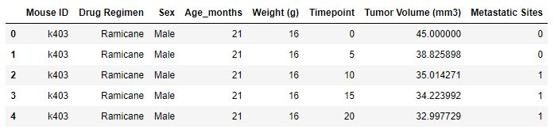
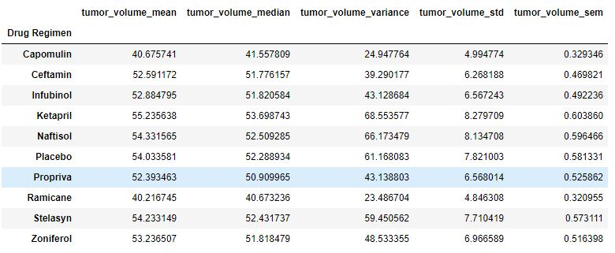
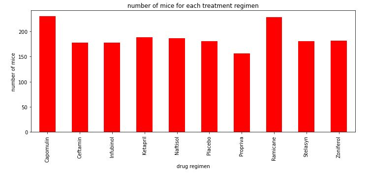
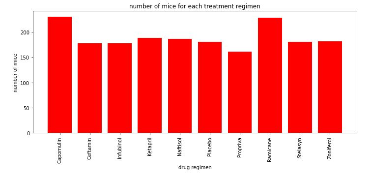
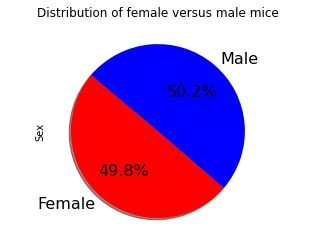
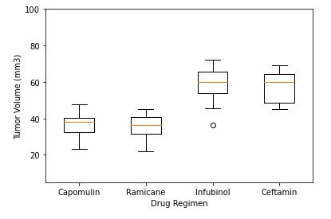
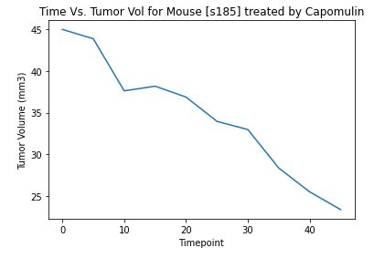
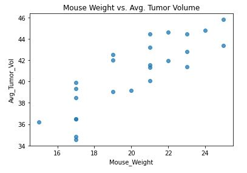
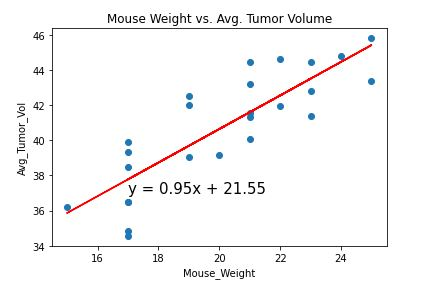

# The Power of Plots

## Background
This respository apply a Python Matplotlib to visualize a real-world pharmaceutical data. The data is sourced from Pymaceuticals Inc., a burgeoning pharmaceutical company based out of San Diego. Pymaceuticals specializes in anti-cancer pharmaceuticals. In its most recent efforts, it began screening for potential treatments for squamous cell carcinoma (SCC), a commonly occurring form of skin cancer.

The purpose of this study was to compare the performance of Pymaceuticals' drug of interest, Capomulin, versus the other treatment regimens. The analysis also generated all of the table and figures needed for the technical, and top-level summary report of the study. For this analysis both datasets imported, merged,cleaned and the aggregate data diplayed in to Python Pandas dataframes, visualized in Matplotlib, and other libraries used in order to make a stastical analysis. The project is conducted in Jupyter notebook to showcase, and communicate the analysis report the following link is created: [Jupyter Notebook Viewer](https://github.com/lotfyah/The-Power-of-Plots/blob/master/pymaceuticals_starter.ipynb) 

## Observations

* The bar graph showed the Drug Regimen Capomulin has the maximum mice number (240), and Propriva has the smaller mice number (155).By removing duplicates the total number of mice is 248. The total count of mice by gender also showed that 124 female mice and 125 male mice.
* The correlation between mouse weight, and average tumor volume is 0.841. It is a strong positive correlation, when the mouse weight increases the average tumor volume also increases.

*  From the selected treatments Capomulin and Ramicane reduces the size of tumors better.

## Data Cleaning
* The data was loaded, read, combined, duplicate removed, and the head (5 rows on the top) of cleaned data out put looks as follows

## Statistics

* The summary statistic table consists of the mean, median, variance, standard deviation, and SEM of the tumor volume for each drug regimen. The summery stastics tables looks as follws:

  
## Bar Charts
  
* Two identical bar charts was generated that shows  the number of total mice for each treatment regimen throughout the course of the study.

  The Bar Cahrts looks as follows:

#### Bar Chart on the Number of Mice per Treatment 

#### Bar Chart on the Number of Mice per Treatment 

## Pie Chart

#### the distribution of female or male mice in the study 

## Box and Whisker Plot

* A box and whisker plot of the final tumor volume for all four treatment regimens was generated, and a potential outliers highlighted by using color, and style.

A box and whisker plot looks as follws:

## Line and Scatter Plots
###  Line Plot
* A line plot created on selected mouse (`s185`) that was treated with Capomulin, and generate a line plot of time point versus tumor volume for that mouse.

   A line plot looks as follws:

###  Scatter Plot
* A scatter plot of mouse weight versus average tumor volume for the Capomulin treatment regimen was created. 

   A scatter plot looks as follws:

## Correlation and Regression

* A correlation coefficient, and linear regression analysis was conducted  between mouse weight and average tumor volume for the Capomulin treatment. 

